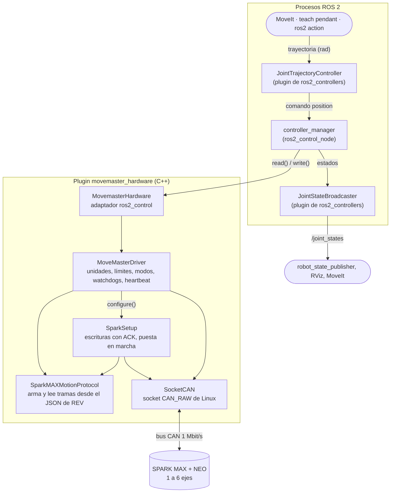
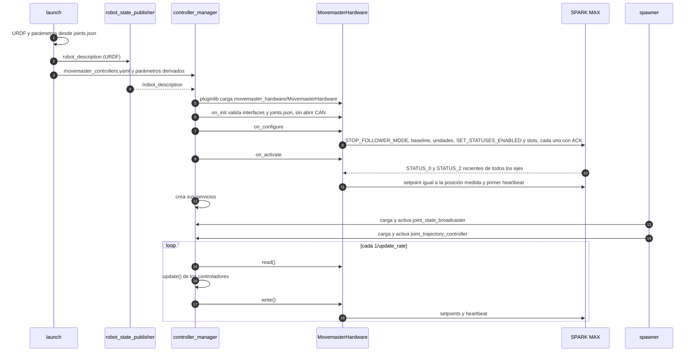

# Manual del nodo controller_manager de MoveMaster

Guía paso a paso para poner en marcha el nodo `controller_manager` de MoveMaster
(ROS 2 Jazzy + `ros2_control`) con los SPARK MAX: desde las pruebas sin ROS
hasta mover un eje desde ROS. Los términos marcados en el texto están definidos
en [DICCIONARIO.md](DICCIONARIO.md).

**Índice**

1. [Mapa de archivos](#1-mapa-de-archivos)
2. [Cómo trabaja el nodo](#2-cómo-trabaja-el-nodo)
3. [Requisitos](#3-requisitos)
4. [Paso 1 · Configurar joints.json](#4-paso-1--configurar-jointsjson)
5. [Paso 2 · Compilar y probar sin ROS](#5-paso-2--compilar-y-probar-sin-ros)
6. [Paso 3 · Preparar el bus CAN y los SPARK](#6-paso-3--preparar-el-bus-can-y-los-spark)
7. [Paso 4 · Probar en el banco sin ROS](#7-paso-4--probar-en-el-banco-sin-ros)
8. [Paso 5 · Compilar el workspace con colcon](#8-paso-5--compilar-el-workspace-con-colcon)
9. [Paso 6 · Arrancar el nodo sin hardware](#9-paso-6--arrancar-el-nodo-sin-hardware)
10. [Paso 7 · Arrancar el nodo con los SPARK MAX](#10-paso-7--arrancar-el-nodo-con-los-spark-max)
11. [Paso 8 · Comprobar y mover un eje](#11-paso-8--comprobar-y-mover-un-eje)
12. [Paso 9 · Detener, fallos y recuperación](#12-paso-9--detener-fallos-y-recuperación)
13. [Los archivos, uno por uno](#13-los-archivos-uno-por-uno)
14. [Problemas frecuentes](#14-problemas-frecuentes)

---

## 1. Mapa de archivos

```text
movemaster_ws/                                  workspace de colcon (desde aquí se compila)
├── colcon_defaults.yaml                        le dice a colcon dónde buscar los paquetes
└── src/
    └── movemaster_ros/                         paquete Python (prototipo movemaster_node)
        └── movemaster_ros/                     ← aquí viven los paquetes del nodo
            ├── docs/                           este manual y el diccionario
            ├── movemaster_hardware/            PLUGIN de hardware (C++)
            │   ├── CMakeLists.txt, package.xml
            │   ├── movemaster_hardware.xml     registro del plugin para pluginlib
            │   ├── include/movemaster_hardware/*.hpp, src/*.cpp
            │   ├── config/joints.json          calibración de los ejes  ← lo editas tú
            │   ├── config/ros2_control.xacro   bloque <ros2_control> del URDF
            │   ├── spec/spark-frames-2.1.0     descripción de las tramas CAN de REV
            │   ├── spec/SparkParameters-v0.1.2.md   tabla de parámetros del SPARK (ID, tipo, fábrica)
            │   ├── docs/                       PARAMETROS, API, diagrama de clases, consola, validación
            │   ├── examples/                   programas sin ROS: demo, monitor, consola, puesta en marcha
            │   └── tests/                      pruebas automáticas
            └── movemaster_control/             NODO controller_manager (configuración + launch)
                ├── CMakeLists.txt, package.xml
                ├── launch/movemaster_control.launch.py
                ├── config/movemaster_controllers.yaml
                ├── urdf/movemaster.urdf.xacro
                └── test/test_robot_description.py
```

Hay dos paquetes de ROS que importan:

| Paquete | Qué es | Lenguaje |
|---|---|---|
| `movemaster_hardware` | El plugin `MovemasterHardware` y todo lo que habla con los SPARK MAX (protocolo, driver, SocketCAN). También compila sin ROS. | C++ |
| `movemaster_control` | No tiene código compilado: configura y arranca el nodo `controller_manager` de `ros2_control` con el plugin y los dos controladores. | Python (launch), XML, YAML |

---

## 2. Cómo trabaja el nodo

### 2.1 Las capas



| Capa | Dónde está | Qué hace |
|---|---|---|
| Controladores | `ros2_controllers` (ya instalado con ROS) | `JointTrajectoryController` (JTC) recibe trayectorias y en cada ciclo escribe la posición deseada de cada eje. `JointStateBroadcaster` (JSB) publica lo que mide el hardware. |
| `controller_manager` | `ros2_control` (ya instalado con ROS) | Carga el plugin de hardware y los controladores, y ejecuta el lazo `read → update → write`. |
| `MovemasterHardware` | `movemaster_hardware/src/movemaster_hardware.cpp` | Traduce el ciclo de vida y las interfaces de `ros2_control` a llamadas al driver. |
| `MoveMasterDriver` | `movemaster_hardware/src/movemaster_driver.cpp` | Configura los SPARK en RAM, convierte radianes ↔ rotaciones de motor, valida límites, vigila la telemetría y envía setpoints Position o MAXMotion + heartbeat. |
| `SparkSetup` | `movemaster_hardware/src/spark_setup.cpp` | Intercambios con ACK de la configuración (baseline, slots) y de la puesta en marcha (restablecer y persistir). |
| `SparkMAXMotionProtocol` | `movemaster_hardware/src/sparkmax_json_protocol.cpp` | Codifica y decodifica cada trama leyendo `spec/spark-frames-2.1.0`. |
| `SocketCAN` | `movemaster_hardware/src/socketcan.cpp` | Abre `can0` y envía/recibe tramas CAN clásicas. |

El diagrama de clases completo está en
[movemaster_hardware/docs/CLASS_DIAGRAM.md](../movemaster_hardware/docs/CLASS_DIAGRAM.md).

### 2.2 El lazo de control

El `controller_manager` repite tres pasos con periodo fijo, `1/update_rate`
(20 ms con `period_s = 0.020`):

1. **`read()`** → `MovemasterHardware::read()` → `MoveMasterDriver::read()`:
   lee del bus, sin esperar, hasta 256 tramas. Por cada `STATUS_2` actualiza
   posición y velocidad de su eje; por cada `STATUS_0`, la corriente. Si alguna
   telemetría tiene más de `feedback_timeout_s`, enclava un fallo. Copia los
   valores a las interfaces de estado `position`, `velocity`, `current`.
2. **`update()`**: cada controlador activo calcula. El JTC interpola la
   trayectoria y escribe la posición deseada en la interfaz de comando
   `position`. El JSB publica `/joint_states`.
3. **`write()`** → `MoveMasterDriver::write()`: valida **todos** los ejes
   (límites de `joints.json`, número finito, cabe en float32 y, en modo
   Position, cerca de la posición medida), convierte a rotaciones de motor,
   envía el setpoint de cada eje con su modo y su slot y al final **un**
   heartbeat global. Si cualquier eje es inválido no envía nada y enclava un
   fallo.

Cada eje usa el modo y el slot de su bloque `control` en `joints.json`. En modo
MAXMotion (`MAXMOTION_POSITION_SETPOINT`), el SPARK genera su propio perfil con
la cruise velocity y la aceleración del slot. En modo Position
(`POSITION_SETPOINT`), su PID persigue cada setpoint sin perfil. Detalle en la
[sección 2.7](#27-modos-de-control-y-slots).

**Heartbeat**: es la trama `0x01011840` con 8 bytes `FF`. Mientras llega, los
SPARK están habilitados; si deja de llegar, su watchdog los deshabilita. No hay
un hilo aparte: si el lazo se detiene, el heartbeat también. Es la base de toda
la seguridad del sistema.

### 2.3 Unidades

ROS trabaja en radianes de la **articulación**; el SPARK, en rotaciones y RPM del
**motor**. Con `G = gear_ratio`, `d = direction` y `q0 = zero_offset_rad`:

```text
posición articulación  q   = q0 + d · rotaciones_motor · 2π / G
rotaciones de motor        = d · (q − q0) · G / 2π
velocidad articulación     = d · RPM_motor · 2π / (60 · G)
```

Ejemplo: `G = 100`, `d = 1`, `q0 = 0`. Mandar `q = 0.5 rad` pide al SPARK
`0.5 · 100 / 2π = 7.96` rotaciones de motor.

La reducción está solo en `gear_ratio`. Los factores de conversión del SPARK
quedan siempre en 1.0, así que PIDF y MAXMotion se escriben en unidades del
motor. El porqué está en la [sección 2.6](#26-qué-se-guarda-en-cada-spark).

`current` está en **amperes** del motor; no es par ni `effort`.

### 2.4 Arranque completo



### 2.5 Estados del hardware

`ros2_control` maneja el hardware como un componente con ciclo de vida:

| Estado | Qué significa para MoveMaster | Cómo se llega |
|---|---|---|
| `unconfigured` | Configuración validada; CAN cerrado; sin driver. | Tras `on_init`, o tras un fallo (`on_error`) o `on_cleanup`. |
| `inactive` | CAN abierto, SPARK configurados en RAM, telemetría llegando; **sin heartbeat**: motores deshabilitados. | `on_configure`, o `on_deactivate` desde `active`. |
| `active` | Heartbeat y setpoints en cada ciclo: motores habilitados manteniendo o siguiendo la posición. | `on_activate`. Por defecto el launch deja el hardware aquí. |
| `finalized` | Apagado. | `on_shutdown`, al cerrar el nodo. |

### 2.6 Qué se guarda en cada SPARK

Cada dato vive en un solo lugar, según lo seguido que cambia:

| Nivel | Datos | Dónde vive | Quién lo escribe |
|---|---|---|---|
| Puesta en marcha | CAN ID, tipo de motor, idle mode, límite de corriente | Flash del SPARK | REV Hardware Client (CAN ID) y `spark_commission` (el resto), una vez por SPARK |
| Eje | Conversión, límites, slots (PIDF, rango de salida, MAXMotion), control de arranque | `joints.json` | El driver, en RAM, cada vez que configura |
| Operación | Modo y slot de cada eje | Memoria del driver | `set_control()` o los comandos `mode` y `slot` de la consola |

- **Solo la puesta en marcha va a flash.** `PERSIST_PARAMETERS` copia a flash
  **todos** los parámetros de la RAM. Por eso `spark_commission` restablece
  antes con `RESET_SAFE_PARAMETERS`, que según REV conserva el CAN ID, el tipo
  de motor y el idle mode (y dos ajustes de entrada que MoveMaster no usa), y
  después escribe el baseline. La flash queda con los valores de fábrica más
  esos cuatro datos.
- **El driver nunca persiste.** En cada `configure()` escribe en RAM, con ACK,
  todo lo que controla, incluido el baseline. Así la operación no depende de lo
  que haya en flash ni de lo que haya guardado otro programa.
- **Los IDs están verificados contra la tabla de parámetros.**
  [`spec/SparkParameters-v0.1.2.md`](../movemaster_hardware/spec/SparkParameters-v0.1.2.md)
  lista los parámetros del SPARK, IDs 0 a 198, con su tipo y valor de fábrica.
  Una prueba compara con ella cada parámetro que escribe el código.

| ID | Parámetro | Valor de MoveMaster |
|---|---|---|
| 2 | Motor Type | BRUSHLESS (1) |
| 6 | Idle Mode | `spark.idle_mode`: COAST (0) o BRAKE (1); de fábrica, COAST |
| 59, 60 | Smart Current Stall Limit, Smart Current Free Limit | `spark.current_limit_a` en los dos; de fábrica, 80 A y 20 A |
| 9 | Closed Loop Control Sensor | MAIN_ENCODER (1) |
| 112, 113 | Position / Velocity Conversion Factor | 1.0 |
| 149 | Position PID Wrap Enable | false |
| 158, 160 | Status 0 Period, Status 2 Period | `status_period_ms` |
| 13+8s a 16+8s | P, I, D, F del slot `s` | `slots.<s>.pidf` |
| 19+8s, 20+8s | Output Min y Output Max del slot `s` | `slots.<s>.output_range` |
| 166+5s, 167+5s, 169+5s | MAXMotion Max Velocity, Max Accel y Allowed Closed Loop Error del slot `s` | `slots.<s>.maxmotion` |

**`gear_ratio` frente al factor de conversión del SPARK.** Los dos convierten
unidades, pero no son intercambiables. El factor (IDs 112 y 113) solo
multiplica: no puede aplicar `zero_offset_rad` ni `direction`, y cambia las
unidades del PID y de MAXMotion, así que las ganancias ajustadas dejarían de
valer. Usar los dos aplicaría la reducción dos veces. Por eso el factor queda
siempre en 1.0 y `gear_ratio` es la única reducción: PIDF y MAXMotion se
escriben en rotaciones y RPM del **motor**.

Tabla completa, valores de fábrica y razones: [PARAMETROS.md](../movemaster_hardware/docs/PARAMETROS.md).

### 2.7 Modos de control y slots

| Modo | Trama | Qué hace el SPARK | Cuándo conviene |
|---|---|---|---|
| `maxmotion` | `MAXMOTION_POSITION_SETPOINT` | Genera un perfil hacia el setpoint con la cruise velocity y la aceleración del slot. | Movimientos punto a punto y jog: el SPARK limita la velocidad. |
| `position` | `POSITION_SETPOINT` | Su PID persigue cada setpoint, sin perfil. | Trayectorias ya perfiladas, como las de MoveIt por el JTC. |

- **Cambiar de modo o de slot es inmediato.** Cada trama de setpoint fija el
  modo (Control Type, ID 5) y lleva el slot en su campo `PID_SLOT`: no se
  escribe ni se persiste ningún parámetro.
- **Un slot es un preset.** Cada uno tiene su PIDF, su rango de salida y,
  opcionalmente, su perfil MAXMotion. Los dos modos usan el PIDF y el rango de
  salida; MAXMotion agrega su perfil. Un slot sin `maxmotion` solo sirve en
  modo `position`.
- **Error de seguimiento.** En modo `position` el SPARK no limita la velocidad:
  un salto grande llevaría el PID a su salida máxima. El driver no envía ningún
  objetivo que quede a más de `max_following_error_rad` de la posición medida,
  y enclava un fallo. Así también detecta un eje que dejó de seguir, por
  ejemplo por un choque.
- **Quién elige el modo.** Cada eje arranca con el `control` de `joints.json`.
  En caliente lo cambian `set_control()` o los comandos `mode` y `slot` de
  `spark_console`, que al cambiar de modo mantiene la posición medida. Desde ROS,
  por ahora, el modo es el de `joints.json`.

---

## 3. Requisitos

- Ubuntu 24.04 con **ROS 2 Jazzy** instalado (`/opt/ros/jazzy`).
- Herramientas: `sudo apt install build-essential cmake python3-colcon-common-extensions python3-rosdep can-utils nlohmann-json3-dev`.
- Interfaz CAN compatible con SocketCAN (por ejemplo, adaptador USB-CAN o HAT CAN para la Raspberry Pi) conectada al bus de los SPARK MAX.
- SPARK MAX con firmware compatible con `spark-frames-2.1.0` (firmware 25 o posterior) y un CAN ID único por eje, asignado con REV Hardware Client. La puesta en marcha de cada SPARK se hace en el [paso 3](#6-paso-3--preparar-el-bus-can-y-los-spark).
- Ningún otro programa enviando heartbeat: cierra el backend Python (`main/`), `pendant_terminal.py`, `spark_console` y `movemaster_node`.

---

## 4. Paso 1 · Configurar joints.json

Archivo: `movemaster_hardware/config/joints.json`. Es la **única** fuente de las
articulaciones: el plugin lo lee para hablar con los motores, y el URDF y el
JTC se generan a partir de él (ver [13.6](#136-movemaster_controlurdfmovemasterurdfxacro)).

### 4.1 Campos globales (opcionales; si faltan, se usa el valor por defecto)

| Campo | Defecto | Regla | Para qué |
|---|---|---|---|
| `period_s` | `0.020` | 0.005 – 0.050 s | Periodo del lazo. El launch pone `update_rate = 1/period_s`. |
| `status_period_ms` | `20` | 1 – 1000, y `3·status_period_ms/1000 ≤ feedback_timeout_s` | Cada cuánto envía el SPARK `STATUS_0` y `STATUS_2`. |
| `feedback_timeout_s` | `0.300` | `≥ 3·period_s` | Edad máxima de la telemetría antes de enclavar un fallo. |
| `response_timeout_s` | `0.500` | 0 – 10 s | Espera máxima de cada ACK al configurar y de la telemetría al activar. |
| `disable_settle_s` | `0.500` | 0 – 10 s | Pausa en silencio antes de configurar y antes de reactivar, para que expire un heartbeat anterior. |
| `max_cycle_gap_s` | `0.100` | `≥ 2·period_s` | Tiempo máximo sin transmitir estando activo; si el lazo se detiene más, fallo. |
| `parameter_layout` | catálogo interno | avanzado | Catálogo alternativo de IDs de parámetros PIDF/MAXMotion. Normalmente no se pone. |

### 4.2 Campos de cada articulación

La clave (por ejemplo `"joint_1"`) es el **nombre** de la articulación en ROS.
El orden del archivo es el orden en el URDF y en el JTC. El cargador es
estricto: una clave desconocida es un error.

| Campo | Tipo | Regla | Significado |
|---|---|---|---|
| `can_id` | entero | 0–63, único | CAN ID del SPARK de ese eje. |
| `gear_ratio` | número | > 0 | Vueltas del motor por cada vuelta de la articulación. |
| `direction` | **entero** | `1` o `-1` (no `1.0`) | `-1` si el motor gira al revés que la articulación en ROS. |
| `zero_offset_rad` | número | finito | Ángulo de la articulación cuando el encoder del motor marca 0. |
| `min_position_rad`, `max_position_rad` | número | `min < max` | Límites calibrados. El driver rechaza objetivos fuera; también son los límites del URDF. |
| `max_velocity_rad_s` | número | > 0 | Velocidad máxima de la articulación: límite del URDF, con el que planea MoveIt. Ninguna `cruise_velocity` puede superarla. |
| `spark` | objeto | ver abajo | Lo que la puesta en marcha guarda en la flash del SPARK. El driver lo vuelve a escribir en RAM al configurar. |
| `control` | objeto | ver abajo | Modo y slot con que se activa el eje. |
| `slots` | objeto | `"0"` a `"3"`, al menos uno | Presets del eje: ganancias y perfiles. |

| Campo de `spark` | Regla | Significado |
|---|---|---|
| `motor_type` | solo `"brushless"` | Los NEO son brushless; el modo brushed puede dañarlos. |
| `idle_mode` | `"coast"` o `"brake"` | Con el eje deshabilitado, `brake` cortocircuita el motor y frena el brazo (no lo sostiene). |
| `current_limit_a` | entero 1–80 | Límite de corriente del motor, en A. 40 es un valor habitual para NEO. |

| Campo de `control` | Regla | Significado |
|---|---|---|
| `mode` | `"maxmotion"` o `"position"` | `maxmotion`: el SPARK perfila el movimiento. `position`: el PID persigue cada setpoint; para trayectorias ya perfiladas. |
| `slot` | uno de `slots` | Slot de arranque. Con `maxmotion`, debe tener perfil. |
| `max_following_error_rad` | > 0 | Solo en modo `position`: distancia máxima entre un objetivo y la posición medida. Más lejos, el driver no envía nada y enclava un fallo. |

| Campo de `slots.<n>` | Regla | Significado |
|---|---|---|
| `pidf` | exactamente `p`, `i`, `d`, `f`; finitos y ≥ 0 | Ganancias del lazo de posición, en unidades del motor. Las usan los dos modos. |
| `output_range` | opcional, `[min, max]` con −1 ≤ min < 0 < max ≤ 1 | Ciclo de trabajo máximo del PID; `[-1, 1]` si falta. |
| `maxmotion.cruise_velocity` | > 0 | Velocidad máxima del **motor**, en RPM. |
| `maxmotion.max_acceleration` | > 0 | Aceleración máxima del motor, en RPM/s. |
| `maxmotion.allowed_profile_error` | ≥ 0 | Error permitido, en rotaciones del motor. |

`maxmotion` es opcional: un slot sin él solo sirve para el modo `position`.

### 4.3 Ejemplo de un eje

Un eje con un NEO sin reducción, en MAXMotion con el slot 0:

```json
{
  "period_s": 0.02,
  "status_period_ms": 20,
  "feedback_timeout_s": 0.3,
  "response_timeout_s": 0.5,
  "disable_settle_s": 0.5,
  "max_cycle_gap_s": 0.1,
  "joints": {
    "joint_1": {
      "can_id": 1, "gear_ratio": 1.0, "direction": 1, "zero_offset_rad": 0,
      "min_position_rad": -3.1416, "max_position_rad": 3.1416, "max_velocity_rad_s": 21.0,
      "spark": {"motor_type": "brushless", "idle_mode": "brake", "current_limit_a": 40},
      "control": {"mode": "maxmotion", "slot": 0, "max_following_error_rad": 0.5},
      "slots": {
        "0": {"pidf": {"p": 1.0, "i": 0, "d": 0, "f": 0},
              "maxmotion": {"cruise_velocity": 200, "max_acceleration": 500, "allowed_profile_error": 0}}
      }
    }
  }
}
```

Para agregar un eje, copia el bloque de `joint_1`, cambia el nombre (`joint_2`),
el `can_id` y sus valores. No hay que tocar nada más.

Qué guarda cada nivel, la tabla de parámetros de REV y cómo pasar un archivo
del formato anterior están en
[PARAMETROS.md](../movemaster_hardware/docs/PARAMETROS.md).

### 4.4 Cuidados

- **No hay homing.** El encoder del NEO es relativo: si su cero cambia al
  apagar el SPARK, `zero_offset_rad` deja de ser válido. Verifica la posición
  antes de activar.
- El launch lee la copia **instalada** de `joints.json`. Si la editas, vuelve a
  compilar (o compila con `--symlink-install`, ver el paso 5) o pásala con
  `joint_config:=/ruta/joints.json`.

---

## 5. Paso 2 · Compilar y probar sin ROS

El plugin compila como un proyecto CMake normal, sin ROS. Sirve para comprobar
el código y probar en el banco.

```bash
cd ~/movemaster/movemaster_ws/src/movemaster_ros/movemaster_ros/movemaster_hardware
cmake -S . -B build -DMOVEMASTER_BUILD_ROS2=OFF -DCMAKE_BUILD_TYPE=Release
cmake --build build -j2
ctest --test-dir build --output-on-failure
```

`-DMOVEMASTER_BUILD_ROS2=OFF` omite el plugin de ROS; quedan las librerías, los
ejemplos y las pruebas. La carpeta `build/` está ignorada por git.

### 5.1 Qué comprueba cada prueba

| Prueba (`ctest`) | Programa | Qué verifica |
|---|---|---|
| `driver_fake_bus` | `tests/driver_test.cpp` | El driver completo contra un SPARK simulado (`tests/simulated_spark_bus.hpp`): 1, 3 y 6 ejes, conversiones, ACKs, orden setpoints → heartbeat, límites, envío en cada ciclo del lazo, baseline y slots en RAM, modos Position y MAXMotion por eje, error de seguimiento, telemetría vencida o corrupta, fallo de TX y lazo detenido. |
| `config_and_commissioning` | `tests/setup_test.cpp` | Que los `joints.json` del repositorio cargan; que cada parámetro que escribe el código coincide en ID, nombre, tipo y valores con `spec/SparkParameters-v0.1.2.md`; los mensajes de error del cargador; y la puesta en marcha: orden restablecer → baseline → persistir, números mágicos, fallos, `spark_commission` y la escucha del bus. |
| `protocol_demo_no_can` | `examples/protocol_demo.cpp` | Que se puede leer el JSON de REV y armar tramas sin abrir CAN. |
| `console_input_and_cycle` | `tests/console_test.cpp` | La lógica de `spark_console` con un driver falso y entrada por tubería, incluidos los comandos `mode` y `slot`. |
| `python_cpp_parity` | `tests/differential_test.py` + `tests/protocol_oracle.cpp` | Que el protocolo C++ produce exactamente los mismos bytes que la librería Python original (`tests/reference/`) en todas las tramas. |

### 5.2 Ver tramas sin hardware

```bash
./build/protocol_demo spec/spark-frames-2.1.0
```

Muestra, sin transmitir, cómo se codifican un setpoint MAXMotion de 0.5
rotaciones, una escritura del parámetro P y su lectura, para el CAN ID 1.

---

## 6. Paso 3 · Preparar el bus CAN y los SPARK

Los SPARK MAX usan CAN a **1 Mbit/s**. Con el adaptador conectado:

```bash
sudo ip link set can0 down
sudo ip link set can0 type can bitrate 1000000
sudo ip link set can0 up
ip -details link show can0        # debe decir state ERROR-ACTIVE y bitrate 1000000
candump can0                      # muestra el tráfico; Ctrl+C para salir
```

Con los SPARK encendidos, `candump` suele mostrar ya tramas periódicas suyas; si
no aparece nada, revisa bitrate, cableado y terminación antes de seguir.
Durante el uso, para el CAN ID 1 verás:

| ID | Trama | Sentido |
|---|---|---|
| `0205B801` | `STATUS_0` (corriente, tensión, temperatura…) | SPARK → PC |
| `0205B881` | `STATUS_2` (posición y velocidad del encoder) | SPARK → PC |
| `02050201` | `MAXMOTION_POSITION_SETPOINT` | PC → SPARK |
| `02050101` | `POSITION_SETPOINT` | PC → SPARK |
| `01011840` | Heartbeat (`FF FF FF FF FF FF FF FF`) | PC → todos |
| `02053801` / `02053841` | `PARAMETER_WRITE` y su respuesta | configuración |
| `02050541` / `02050581` | `RESET_SAFE_PARAMETERS` y su respuesta | puesta en marcha |
| `0205FFC1` / `02050501` | `PERSIST_PARAMETERS` y su respuesta | puesta en marcha |

Los últimos dos dígitos hex dependen del CAN ID: el ID es
`(arbId & ~0x3F) | can_id`. Con `can_id = 2`, `STATUS_2` sería `0205B882`.

### 6.1 Puesta en marcha de cada SPARK

Se hace una vez por SPARK, y otra vez al reemplazarlo o al cambiar su bloque
`spark`. Deja en la flash solo el CAN ID, el tipo de motor, el idle mode y el
límite de corriente; todo lo demás vuelve al valor de fábrica, porque el driver
lo escribe en RAM cada vez que configura.

Requiere el paso 2 compilado, `joints.json` con los bloques `spark` completos y
ningún emisor de heartbeat abierto. Desde `movemaster_hardware/`:

```bash
./build/spark_commission spec/spark-frames-2.1.0 config/joints.json can0
```

Sin `--apply` solo escucha el bus durante 0.5 s y no transmite nada. Indica si
cada SPARK responde en su CAN ID y si alguien envía el heartbeat de
habilitación, y muestra lo que quedaría en flash. Si todo está en orden:

```bash
./build/spark_commission spec/spark-frames-2.1.0 config/joints.json can0 --apply
./build/spark_commission spec/spark-frames-2.1.0 config/joints.json can0 --apply joint_2   # solo un eje
```

Para cada SPARK envía `RESET_SAFE_PARAMETERS`, escribe el baseline con ACK y
termina con `PERSIST_PARAMETERS`. Si un paso falla, se detiene e indica qué eje
repetir.

Después, comprueba el sentido de cada eje con `driver_monitor` (paso 4),
girándolo a mano. El restablecimiento deja `Inverted` (ID 45) en `false`: si lo
habías activado en REV Hardware Client, el motor ahora gira al revés que antes,
y se corrige con `direction` en `joints.json`.

Los IDs del baseline coinciden con la tabla de parámetros, pero aún no se han probado
con un SPARK real: la primera vez, hazlo con un solo SPARK en el bus y revisa
el resultado en REV Hardware Client después de apagarlo y encenderlo. Detalle en
[PARAMETROS.md](../movemaster_hardware/docs/PARAMETROS.md#puesta-en-marcha-de-un-spark).

---

## 7. Paso 4 · Probar en el banco sin ROS

Antes de usar ROS conviene validar cada eje con estos dos programas (están en
`build/` tras el paso 2, o como `ros2 run movemaster_hardware <programa>` tras
el paso 5). `spark_commission` está en el mismo lugar.

### 7.1 driver_monitor: configurar y leer, sin habilitar

```bash
./build/driver_monitor spec/spark-frames-2.1.0 config/joints.json can0
```

Escribe en RAM la configuración de cada SPARK (con ACK), habilita la telemetría
y muestra cada 100 ms la posición (rad), velocidad (rad/s) y corriente (A) de
cada eje. **No envía heartbeat**: los motores no se mueven. Úsalo para
comprobar que todos los ejes responden y que la conversión de unidades es la
correcta (gira el eje a mano y mira el signo y la magnitud).

### 7.2 spark_console: mover un eje

```bash
./build/spark_console spec/spark-frames-2.1.0 config/joints.json can0
```

Requiere un `joints.json` con **un solo** eje. Arranca con el `control` de ese
eje. Comandos:

| Comando | Acción |
|---|---|
| `on` | Habilita manteniendo la posición medida. |
| `sp 0.5` | Va a la posición absoluta 0.5 **rotaciones de motor**. En modo `position`, solo si queda a menos de `max_following_error_rad` de la posición medida. |
| `mode position` / `mode maxmotion` | Cambia el modo; con el eje habilitado, mantiene la posición medida. |
| `slot 1` | Cambia de slot (de preset). |
| `pv` | Muestra posición, corriente, modo, slot y estado. |
| `off` | Deja de enviar heartbeat (el watchdog deshabilita). |
| `q` | Deshabilita y sale. |

En modo `position` sirve para ver la respuesta del PID a escalones pequeños.
Más detalle en [SPARK_CONSOLE.md](../movemaster_hardware/docs/SPARK_CONSOLE.md).

---

## 8. Paso 5 · Compilar el workspace con colcon

Siempre desde la raíz del workspace, para que colcon lea `colcon_defaults.yaml`:

```bash
source /opt/ros/jazzy/setup.bash
cd ~/movemaster/movemaster_ws
sudo rosdep init        # solo la primera vez en la máquina
rosdep update
rosdep install --from-paths src src/movemaster_ros/movemaster_ros --ignore-src -r -y
colcon build --symlink-install --packages-up-to movemaster_control --cmake-args -DCMAKE_BUILD_TYPE=Release
source install/setup.bash
```

- `rosdep install` instala todo lo que piden los `package.xml`
  (`ros2_control`, `ros2_controllers`, `xacro`, `nlohmann-json`…). Necesita las
  dos rutas porque rosdep, como colcon, no entra en el paquete Python
  `movemaster_ros`.
- `--packages-up-to movemaster_control` compila `movemaster_hardware` y luego
  `movemaster_control`.
- `--symlink-install` instala enlaces a los archivos de configuración en lugar
  de copias: los cambios en `joints.json`, el YAML o el launch se aplican sin
  recompilar.
- `source install/setup.bash` hay que hacerlo **en cada terminal** nueva.

Comprobaciones:

```bash
colcon list                                     # movemaster_hardware debe estar en src/movemaster_ros/movemaster_ros/
colcon test --packages-select movemaster_hardware movemaster_control
colcon test-result --verbose
ros2 pkg prefix movemaster_hardware             # debe apuntar a install/movemaster_hardware
```

---

## 9. Paso 6 · Arrancar el nodo sin hardware

Primero prueba toda la cadena ROS con hardware simulado
(`mock_components/GenericSystem`): mismas interfaces, sin CAN ni motores.
El eje simulado sigue al comando al instante.

```bash
ros2 launch movemaster_control movemaster_control.launch.py use_mock_hardware:=true
```

Debes ver, entre otras, estas líneas:

- `MoveMaster: joint_1 a 50 Hz con hardware simulado.`
- `Resource Manager has been successfully initialized`
- `Configured and activated joint_state_broadcaster`
- `Configured and activated joint_trajectory_controller`

En otra terminal (con `source install/setup.bash`) sigue el
[paso 8](#11-paso-8--comprobar-y-mover-un-eje).

---

## 10. Paso 7 · Arrancar el nodo con los SPARK MAX

Lista previa:

1. `can0` arriba a 1 Mbit/s (paso 3) y los SPARK visibles en `candump`.
2. Puesta en marcha hecha (paso 3) y `joints.json` validado con `driver_monitor` (paso 4).
3. Ningún otro emisor de heartbeat abierto.
4. El brazo libre para moverse dentro de los límites; la alimentación con
   corte físico al alcance. Deshabilitar **no** es una parada de emergencia.

```bash
ros2 launch movemaster_control movemaster_control.launch.py
```

Al arrancar el hardware se configura (STOP_FOLLOWER_MODE, baseline, unidades
y slots, cada uno con ACK) y se **activa manteniendo la posición medida**, con
el modo y el slot de `control`: a partir de ese momento los motores aplican par
para sostenerse.

Argumentos del launch:

| Argumento | Por defecto | Uso |
|---|---|---|
| `use_mock_hardware` | `false` | `true` para hardware simulado. |
| `joint_config` | `joints.json` instalado de `movemaster_hardware` | Otra calibración. |
| `can_interface` | `can0` | Otra interfaz SocketCAN. |
| `controllers_file` | `movemaster_controllers.yaml` de `movemaster_control` | Otros parámetros de controladores. |
| `description_file` | `movemaster.urdf.xacro` de `movemaster_control` | Otro modelo (el futuro `movemaster_description`). |

Ver todos: `ros2 launch movemaster_control movemaster_control.launch.py --show-args`.

---

## 11. Paso 8 · Comprobar y mover un eje

### 11.1 Estado

```bash
ros2 control list_hardware_components     # MovemasterSystem: state active
ros2 control list_hardware_interfaces     # joint_1/position [claimed] por el JTC
ros2 control list_controllers             # joint_state_broadcaster y joint_trajectory_controller: active
ros2 topic echo --once /joint_states      # position (rad) y velocity (rad/s)
ros2 topic echo --once /dynamic_joint_states   # además current (A)
ros2 topic hz /joint_states               # ≈ 50 Hz
ros2 param get /controller_manager update_rate
```

### 11.2 Mover

El JTC recibe **posiciones absolutas en radianes** y parte de la posición
actual. Mira la posición en `/joint_states` y elige un objetivo **dentro de los
límites de `joints.json`**; fuera de ellos el driver rechaza la orden y enclava
un fallo.

Con la acción (te devuelve el resultado al terminar):

```bash
ros2 action send_goal /joint_trajectory_controller/follow_joint_trajectory \
  control_msgs/action/FollowJointTrajectory \
  "{trajectory: {joint_names: [joint_1], points: [{positions: [0.5], time_from_start: {sec: 3}}]}}"
```

Con un tópico (sin respuesta):

```bash
ros2 topic pub --once /joint_trajectory_controller/joint_trajectory \
  trajectory_msgs/msg/JointTrajectory \
  "{joint_names: [joint_1], points: [{positions: [0.0], time_from_start: {sec: 3}}]}"
```

Con varios ejes, `joint_names` y `positions` llevan un valor por eje en el mismo
orden. `time_from_start` debe dar tiempo. En modo `maxmotion` el SPARK no
supera la `cruise_velocity` del slot, así que un movimiento demasiado rápido
llega tarde y la acción espera a que el eje se detenga. En modo `position` no
hay ese límite: si el eje se queda más de `max_following_error_rad` atrás, el
driver enclava un fallo.

Seguimiento: `ros2 topic echo /joint_trajectory_controller/controller_state`
muestra la posición deseada, la medida y el error.

---

## 12. Paso 9 · Detener, fallos y recuperación

**Detener**: `Ctrl+C` en la terminal del launch. El hardware deja de enviar
heartbeat y el watchdog del SPARK deshabilita los motores. El brazo puede caer
por gravedad al perder el par.

**Fallos**: el driver **enclava** cualquier fallo (ACK incorrecto, telemetría
vencida, objetivo fuera de límites, lazo detenido, error de CAN):

1. deja de enviar heartbeat → los SPARK se deshabilitan;
2. `ros2_control` desactiva el hardware y los dos controladores;
3. el hardware queda `unconfigured`; el motivo aparece en el log del
   `controller_manager` (líneas `[MovemasterHardware]`).

Para volver, una vez corregida la causa:

```bash
ros2 control set_hardware_component_state MovemasterSystem active
ros2 control switch_controllers --activate joint_state_broadcaster joint_trajectory_controller
```

La reactivación crea un driver nuevo, repite la configuración de los SPARK y
vuelve a mantener la posición medida.

Deshabilitar sin cerrar el nodo. Cambiar el estado del hardware no desactiva los
controladores, así que primero se desactiva el JTC y al volver se activa al final:

```bash
ros2 control switch_controllers --deactivate joint_trajectory_controller
ros2 control set_hardware_component_state MovemasterSystem inactive   # sin heartbeat
# ...
ros2 control set_hardware_component_state MovemasterSystem active     # vuelve a sostener
ros2 control switch_controllers --activate joint_trajectory_controller
```

---

## 13. Los archivos, uno por uno

### 13.1 `movemaster_ws/colcon_defaults.yaml`

```yaml
build:
  base-paths: &base_paths [src, src/movemaster_ros/movemaster_ros]
test:
  base-paths: *base_paths
...
```

colcon busca paquetes recorriendo carpetas, pero **no entra en una carpeta que
ya es un paquete**. `src/movemaster_ros` es un paquete Python, así que colcon no
veía nada de `src/movemaster_ros/movemaster_ros/`. Este archivo, que colcon lee
del directorio desde donde se ejecuta, le añade esa carpeta como segunda base
de búsqueda para `build`, `test`, `list`, `graph` e `info`. `&base_paths` define
la lista una vez y `*base_paths` la reutiliza (alias de YAML).

### 13.2 `package.xml` (los dos paquetes)

Es el manifiesto de un paquete ROS (formato 3): nombre, versión, descripción,
responsable, licencia y **dependencias**. colcon lo usa para el orden de
compilación y rosdep para instalar lo que falta.

| Etiqueta | Significado |
|---|---|
| `<buildtool_depend>ament_cmake</buildtool_depend>` | Herramienta con la que se compila. |
| `<depend>X</depend>` | X se necesita para compilar **y** ejecutar. |
| `<exec_depend>X</exec_depend>` | X solo se necesita al ejecutar. |
| `<test_depend>X</test_depend>` | X solo para las pruebas. |
| `<export><build_type>ament_cmake</build_type></export>` | Tipo de paquete para colcon. |

- `movemaster_hardware`: `depend` de `hardware_interface`, `pluginlib`, `rclcpp`,
  `rclcpp_lifecycle` y `nlohmann-json-dev`, porque el plugin los usa al compilar.
- `movemaster_control`: solo `exec_depend` (`controller_manager`,
  `joint_trajectory_controller`, `joint_state_broadcaster`,
  `robot_state_publisher`, `xacro`, `movemaster_hardware`…), porque no compila
  código: solo instala archivos que se usan al ejecutar.

### 13.3 `movemaster_hardware/CMakeLists.txt`

| Bloque | Qué hace |
|---|---|
| `project(movemaster_hardware VERSION 0.2.0 LANGUAGES CXX)`, `CMAKE_CXX_STANDARD 17` | Proyecto C++17. |
| `option(MOVEMASTER_BUILD_ROS2 ... ON)` | Permite compilar sin ROS con `-DMOVEMASTER_BUILD_ROS2=OFF`. |
| `include(CTest)` | Activa `BUILD_TESTING` y `add_test`. |
| `find_package(nlohmann_json QUIET)` + `find_path(...)` | Busca la librería JSON; si no hay paquete CMake, usa el header `nlohmann/json.hpp`. |
| `add_library(sparkmax_protocol STATIC ...)`, `add_library(movemaster_driver STATIC ...)` | Dos librerías **estáticas**: protocolo y driver (+ SocketCAN, `spark_setup.cpp` y `driver_config.cpp`). |
| `POSITION_INDEPENDENT_CODE ON` | Permite meterlas dentro de la librería compartida del plugin (ver `docs/LINKING_FIX.md`). |
| `target_include_directories(... include)`, `-Wall -Wextra -Wpedantic` | Headers públicos y avisos del compilador. |
| `target_link_libraries(... nlohmann_json, Threads)` | Dependencias de las librerías. |
| `add_executable(protocol_demo / driver_monitor / spark_console / spark_commission ...)` | Programas de ejemplo y la herramienta de puesta en marcha. |
| `if(BUILD_TESTING) ... add_test(...)` | Las cinco pruebas de `ctest` (paso 2). |
| `if(MOVEMASTER_BUILD_ROS2)` → `find_package(ament_cmake hardware_interface pluginlib rclcpp rclcpp_lifecycle)` | Solo con ROS: dependencias del plugin. |
| `add_library(movemaster_hardware SHARED src/movemaster_hardware.cpp)` | El plugin: una librería **compartida** (`libmovemaster_hardware.so`) que el `controller_manager` carga en tiempo de ejecución. |
| `pluginlib_export_plugin_description_file(hardware_interface movemaster_hardware.xml)` | Registra el plugin en el índice de ament para que pluginlib lo encuentre. |
| `install(...)` | Instala librerías, ejemplos (en `lib/movemaster_hardware`, para `ros2 run`), headers y las carpetas `spec`, `config` y `docs` en `share/movemaster_hardware`. |
| `ament_export_*`, `ament_package()` | Exporta el paquete para otros paquetes CMake y genera los archivos de ament. |

### 13.4 `movemaster_control/CMakeLists.txt`

```cmake
find_package(ament_cmake REQUIRED)
install(DIRECTORY config launch urdf DESTINATION share/${PROJECT_NAME})
if(BUILD_TESTING)
  find_package(ament_cmake_pytest REQUIRED)
  ament_add_pytest_test(robot_description test/test_robot_description.py)
endif()
ament_package()
```

No compila nada: copia `config/`, `launch/` y `urdf/` a
`install/movemaster_control/share/movemaster_control/`, de donde los lee
`ros2 launch`, y registra la prueba de pytest para `colcon test`.

### 13.5 `movemaster_hardware/movemaster_hardware.xml` (pluginlib)

```xml
<library path="movemaster_hardware">
  <class name="movemaster_hardware/MovemasterHardware"
         type="movemaster::MovemasterHardware"
         base_class_type="hardware_interface::SystemInterface">
```

| Atributo | Significado |
|---|---|
| `path` | Librería que contiene la clase: `libmovemaster_hardware.so`. |
| `name` | Nombre con el que se pide el plugin; es el que aparece en `<plugin>` del URDF. |
| `type` | Clase C++ real. |
| `base_class_type` | Interfaz que implementa; pluginlib solo la ofrece a quien pide un `SystemInterface`. |

Tres piezas deben coincidir: este XML, la macro
`PLUGINLIB_EXPORT_CLASS(movemaster::MovemasterHardware, hardware_interface::SystemInterface)`
al final de `movemaster_hardware.cpp` y `pluginlib_export_plugin_description_file`
en el CMake.

### 13.6 `movemaster_control/urdf/movemaster.urdf.xacro`

Genera el URDF que recibe el `controller_manager`. Recibe cuatro argumentos
(`joint_config`, `spec_path`, `can_interface`, `use_mock_hardware`) y:

1. lee `joints.json` con `xacro.load_yaml` (JSON es YAML válido);
2. crea una cadena `base_link → joint_1 → joint_1_link → joint_2 → …`, una
   articulación `revolute` por eje, con `lower`/`upper` = límites de
   `joints.json` y `velocity` = `max_velocity_rad_s`;
3. incluye el macro del plugin para el bloque `<ros2_control>`.

La geometría es **provisional**: eslabones sin forma ni longitud, ejes en `z`.
Sirve para `ros2_control` y `robot_state_publisher`, no para MoveIt. Para ver el
URDF que se genera:

```bash
xacro $(ros2 pkg prefix --share movemaster_control)/urdf/movemaster.urdf.xacro use_mock_hardware:=true
```

### 13.7 `movemaster_hardware/config/ros2_control.xacro`

Macro `movemaster_ros2_control` que escribe el bloque `<ros2_control>`:

- `<hardware>`: con `use_mock_hardware=false`, el plugin
  `movemaster_hardware/MovemasterHardware` y sus parámetros `spec_path`,
  `joint_config_path`, `can_interface` (los lee `on_init`); con `true`,
  `mock_components/GenericSystem`.
- Un `<joint>` por eje de `joints.json`, en su orden, con la interfaz de comando
  `position` y las de estado `position`, `velocity` y `current`.
  `initial_value` solo lo usa el hardware simulado.

`on_init` exige exactamente un comando `position`, estados `position` y
`velocity` (y `current` opcional), y la misma lista de articulaciones que
`joints.json`. El macro lo cumple por construcción.

### 13.8 `movemaster_control/config/movemaster_controllers.yaml`

Parámetros que lee el `controller_manager` (y, por nombre de nodo, cada
controlador):

```yaml
controller_manager:
  ros__parameters:
    update_rate: 50              # el launch lo reemplaza por 1/period_s
    joint_state_broadcaster:
      type: joint_state_broadcaster/JointStateBroadcaster
    joint_trajectory_controller:
      type: joint_trajectory_controller/JointTrajectoryController
joint_trajectory_controller:
  ros__parameters:
    command_interfaces: [position]
    state_interfaces: [position, velocity]
```

- La sección `controller_manager` declara qué controladores existen y de qué
  tipo (nombre del plugin).
- La sección `joint_trajectory_controller` configura el JTC. Su lista `joints`
  no está aquí: la añade el launch desde `joints.json`.
- Las tolerancias del JTC se dejan por defecto a propósito: con MAXMotion el
  eje llega con retraso, y si una tolerancia venciera el JTC fijaría la
  posición medida y el eje quedaría antes del objetivo.
- El JSB no necesita parámetros: publica todas las articulaciones.

### 13.9 `movemaster_control/launch/movemaster_control.launch.py`

Un *launch file* de ROS 2 en Python. `generate_launch_description()` declara los
argumentos y una `OpaqueFunction` que, ya con los valores resueltos:

1. lee y valida `joints.json` (que exista, que tenga articulaciones, que
   `period_s` esté en rango);
2. calcula `update_rate = round(1/period_s)` y la lista de articulaciones;
3. procesa el xacro y obtiene el URDF;
4. escribe en un YAML temporal `update_rate` y los `joints` del JTC;
5. arranca `robot_state_publisher` (con el URDF), `ros2_control_node` (con el
   YAML de controladores y luego el temporal, que manda sobre el primero) y un
   `spawner` que carga y activa los dos controladores; si el
   `controller_manager` no responde en 60 s, el spawner falla.

### 13.10 `movemaster_hardware/spec/`

- **`spark-frames-2.1.0`**: JSON oficial de REV que describe cada trama CAN del
  SPARK: ID base, longitud y cada señal (posición de bit, tipo, escala). El
  protocolo C++ no tiene IDs de trama escritos a mano: los lee de aquí.
- **`SparkParameters-v0.1.2.md`**: tabla de los parámetros del SPARK, IDs 0 a
  198, con tipo, modo de acceso, valor de fábrica y descripción, y las enumeraciones
  (`MotorType`, `IdleMode`, `Sensor`…). Los IDs de parámetros del código están
  en C++ (`DEFAULT_PARAMETER_LAYOUT` y `spark_setup.hpp`), y `setup_test` los
  compara con esta tabla en cada compilación. Su "Status Period" dice μs, pero
  la unidad real es ms.

Ninguno de los dos se modifica.

### 13.11 Programas de ejemplo y pruebas

| Archivo | Tipo | Necesita CAN | Uso |
|---|---|---|---|
| `examples/protocol_demo.cpp` | ejemplo | no | Ver cómo se codifican tramas. |
| `examples/driver_monitor.cpp` | ejemplo | sí | Configurar y leer telemetría sin habilitar (paso 4). |
| `examples/spark_console.cpp` | ejemplo | sí | Mover un eje desde el teclado, en Position o MAXMotion (paso 4). |
| `examples/spark_commission.cpp` | herramienta | sí | Puesta en marcha: restablecer, escribir el baseline y persistir (paso 3). |
| `tests/driver_test.cpp` | prueba | no | Driver contra SPARK simulado. |
| `tests/setup_test.cpp` | prueba | no | Cargador de `joints.json` y puesta en marcha contra SPARK simulado. |
| `tests/console_test.cpp` | prueba | no | Bucle de la consola con driver falso. |
| `tests/protocol_oracle.cpp` + `tests/differential_test.py` | prueba | no | Paridad byte a byte con la librería Python. |
| `movemaster_control/test/test_robot_description.py` | prueba | no | El URDF generado cumple lo que exigen el plugin y `ros2_control`. |

---

## 14. Problemas frecuentes

| Síntoma o mensaje | Causa probable | Solución |
|---|---|---|
| `Package 'movemaster_control' not found` | No hiciste `source install/setup.bash` o compilaste fuera de `movemaster_ws/`. | Compila desde `movemaster_ws/` y haz `source` en cada terminal. |
| `colcon list` no muestra `movemaster_hardware` ni `movemaster_control` | colcon no leyó `colcon_defaults.yaml`: no lo ejecutaste desde `movemaster_ws/`. | Ejecuta colcon desde `movemaster_ws/`. |
| `CMake Error: The source ".../movemaster_hardware/CMakeLists.txt" does not match the source ".../src/movemaster_hardware/CMakeLists.txt" used to generate cache` | `build/movemaster_hardware` se configuró con la copia vieja del plugin (`src/movemaster_hardware`), que ya no existe. CMake no reutiliza un caché de otra carpeta. | Desde `movemaster_ws/`: `rm -rf build/movemaster_hardware install/movemaster_hardware` y vuelve a compilar. |
| `Configured joints must exactly match the ros2_control joint list` | El URDF y `joints.json` declaran articulaciones distintas (por ejemplo, un URDF propio con otra lista). | Usa el macro `movemaster_ros2_control`, que las genera desde `joints.json`. |
| `Configuration for joint_1: direction must be an integer` | `direction` escrito como `1.0`. | Escribe `1` o `-1`. |
| `joint_1: invalid position limits` | `min_position_rad ≥ max_position_rad`. | Corrige los límites. |
| `Configuration for joint_1: gear_ratio must be a number` | Un campo vacío, en `null` o escrito como texto. | Completa el valor. |
| `Configuration for joint_1: slot moved in joints.json v2: ...` | `joints.json` tiene el formato anterior. | Pásalo al formato v2 con la tabla de [PARAMETROS.md](../movemaster_hardware/docs/PARAMETROS.md#pasar-del-formato-anterior). |
| `Configuration for joint_1: spark.idle is not a known key` | Una clave mal escrita. | Corrige el nombre; el mensaje dice en qué bloque está. |
| `joint_1 slot 0: MAXMotion cruise_velocity exceeds max_velocity_rad_s` | El perfil del slot movería la articulación más rápido que su límite. | Baja `cruise_velocity` o revisa `max_velocity_rad_s` y `gear_ratio`. |
| `joint_1: MAXMotion control needs a maxmotion block in slot 1` | `control` arranca en `maxmotion` con un slot sin perfil. | Agrega `maxmotion` al slot o usa `"mode": "position"`. |
| `if_nametoindex: No such device` | No existe `can0` (adaptador desconectado o con otro nombre). | `ip link`; usa `can_interface:=...`. |
| `write(SocketCAN): Network is down` | `can0` existe pero está abajo. | Paso 3. |
| `Timeout waiting for STOP_FOLLOWER_MODE_RESPONSE on CAN 1` | El SPARK con ese CAN ID no responde: ID equivocado, sin alimentación, bitrate distinto, firmware antiguo. | Revisa con `candump` que aparezcan sus `STATUS`; confirma ID y firmware. |
| `Parameter ACK mismatch: CAN 1, p` | El SPARK no aceptó o no confirmó el valor de un parámetro. | Revisa el valor en `joints.json` y el firmware. Si el parámetro es `motor_type`, `idle_mode`, `smart_current_*`, `output_min` u `output_max`, anótalo: son IDs que aún no se habían probado con un SPARK real. |
| `Fresh STATUS_0 and STATUS_2 required for every joint` | Al activar, falta telemetría reciente de algún eje. | Revisa cableado, `status_period_ms` y que todos los ejes respondan en `driver_monitor`. |
| `STATUS_0/2 watchdog expired` | Se dejó de recibir telemetría con el brazo activo. | Cable o alimentación; luego recupera (paso 9). |
| `Control loop gap exceeded; refusing automatic re-enable` | El lazo se detuvo más de `max_cycle_gap_s` (PC sobrecargado, depurador). | Recupera (paso 9); si se repite, sube `max_cycle_gap_s` con cuidado. |
| `joint_1: position command outside calibrated limits` | El JTC pidió un objetivo fuera de los límites. | Envía objetivos dentro de `joints.json`; recupera. |
| `joint_1: Position target exceeds max_following_error_rad from the measured position` | En modo `position`, el objetivo quedó demasiado lejos del eje: trayectoria muy rápida, ganancias bajas o un choque. | Da más `time_from_start`, revisa el PID o el obstáculo; sube `max_following_error_rad` solo con margen medido. Recupera. |
| `spark_commission`: `NO RESPONDE` | Ese CAN ID no envía `STATUS_0`. | Revisa CAN ID, alimentación y `candump`. |
| `spark_commission`: `Hay un heartbeat de habilitacion en el bus` | Otro programa está habilitando motores. | Cierra el `controller_manager`, `spark_console` o el backend Python. |
| `RESET_SAFE_PARAMETERS rejected on CAN 1: RESULT_CODE 1` o `Timeout waiting for PERSIST_PARAMETERS_RESPONSE on CAN 1` | El SPARK rechazó o no confirmó el restablecimiento o el guardado. | Repite la puesta en marcha de ese eje; si persiste, revisa el firmware con REV Hardware Client. |
| `CAN error frame received: ...` | El adaptador reportó un error de bus; el texto dice cuál (por ejemplo `controller tx-warning`, `protocol stuff, bus-error`, `bus-off`). | `ip -details -statistics link show can0` y `candump -e can0,0~0,#FFFFFFFF` mientras se reproduce; revisa resistencias de 120 Ω, cableado y bitrate. |
| El brazo se mueve en sentido contrario | `direction` invertido. | Cambia `direction`; verifica con `driver_monitor` antes. |
| Después de la puesta en marcha, un eje gira al revés que antes | El restablecimiento dejó `Inverted` (ID 45) en `false`, y antes estaba activado en REV Hardware Client. | Corrige `direction` en `joints.json`; MoveMaster no usa `Inverted`. |
| La posición en ROS no coincide con la real | `zero_offset_rad` o `gear_ratio` incorrectos, o el encoder perdió su cero. | Recalibra con `driver_monitor`. |
| Cambié `joints.json` y no pasa nada | El launch lee la copia instalada. | Compila con `--symlink-install` o vuelve a compilar. |
| La acción termina tarde | En modo `maxmotion`, el SPARK limita la velocidad a la `cruise_velocity` del slot; la trayectoria pedía más. | Da más `time_from_start` o sube `cruise_velocity`, sin pasar de `max_velocity_rad_s`. |
