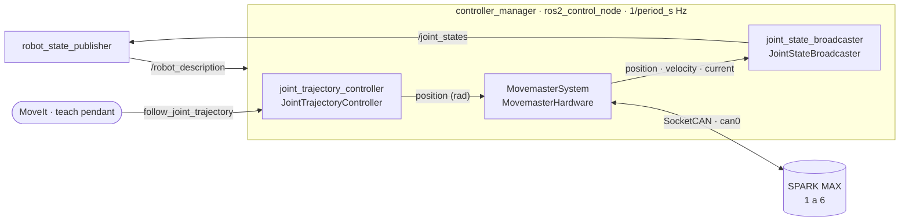

# movemaster_control

Nodo `controller_manager` de MoveMaster para ROS 2 Jazzy: `ros2_control` con el
plugin propio `MovemasterHardware`, `JointStateBroadcaster` y
`JointTrajectoryController`. Los dos controladores vienen con `ros2_controllers`;
este paquete solo los configura y los arranca.

Guía paso a paso, desde las pruebas sin ROS hasta mover un eje:
[docs/MANUAL.md](../docs/MANUAL.md). Términos: [docs/DICCIONARIO.md](../docs/DICCIONARIO.md).



El launch arranca tres procesos:

| Proceso | Para qué |
|---|---|
| `robot_state_publisher` | Publica `/robot_description`, de donde el `controller_manager` de Jazzy carga el hardware, y el TF a partir de `/joint_states`. |
| `ros2_control_node` (`/controller_manager`) | Ejecuta el lazo `read → update → write` con `MovemasterHardware` o con hardware simulado. |
| `spawner` | Carga y activa `joint_state_broadcaster` y luego `joint_trajectory_controller`. |

## joints.json es la única fuente de las articulaciones

El plugin exige que el bloque `<ros2_control>` declare exactamente las
articulaciones de su `joints.json`. Para que eso no dependa de mantener listas a
mano, todo lo demás se genera a partir de ese archivo:

| Qué | De dónde sale |
|---|---|
| Articulaciones del URDF y del bloque `<ros2_control>`, en orden | Claves de `joints` |
| Límites `lower` / `upper` del URDF | `min_position_rad` / `max_position_rad` |
| Límite de velocidad del URDF (rad/s) | `max_velocity_rad_s` |
| `joints` del `JointTrajectoryController` | Claves de `joints` |
| `update_rate` del `controller_manager` | `1 / period_s` |

Para instalar un eje nuevo basta con añadirlo a `joints.json`.

## Compilar

Este paquete y el plugin viven en `src/movemaster_ros/movemaster_ros/`, dentro del
paquete Python `movemaster_ros`. colcon no busca paquetes dentro de otro paquete;
`movemaster_ws/colcon_defaults.yaml` le indica esa carpeta, así que colcon debe
ejecutarse desde `movemaster_ws/`. rosdep necesita las dos rutas.

```bash
source /opt/ros/jazzy/setup.bash
cd ~/movemaster/movemaster_ws
rosdep install --from-paths src src/movemaster_ros/movemaster_ros --ignore-src -r -y
colcon build --packages-up-to movemaster_control --cmake-args -DCMAKE_BUILD_TYPE=Release
source install/setup.bash
colcon test --packages-select movemaster_control movemaster_hardware
colcon test-result --verbose
```

## Arrancar

Sin motores ni CAN, con `mock_components/GenericSystem` y las mismas interfaces:

```bash
ros2 launch movemaster_control movemaster_control.launch.py use_mock_hardware:=true
```

Con los SPARK MAX, cuando `can0` ya está levantada a la velocidad del banco y no
hay otro emisor de heartbeat (el backend Python o `movemaster_node`):

```bash
ros2 launch movemaster_control movemaster_control.launch.py
```

Al arrancar, el hardware se configura (ACK de cada parámetro) y se activa
manteniendo la posición medida: desde ese momento los motores quedan habilitados.
Si la configuración falla, por ejemplo con `can0` caída o un SPARK que no
responde, el error del driver aparece en la salida del `controller_manager` y el
spawner termina a los 60 s.

| Argumento | Por defecto | Uso |
|---|---|---|
| `use_mock_hardware` | `false` | `true` para probar sin hardware. |
| `joint_config` | `joints.json` de `movemaster_hardware` | Calibración de los ejes. |
| `can_interface` | `can0` | Interfaz SocketCAN. |
| `controllers_file` | `config/movemaster_controllers.yaml` | Parámetros del `controller_manager` y de los controladores. |
| `description_file` | `urdf/movemaster.urdf.xacro` | Modelo del robot; recibe `joint_config`, `can_interface` y `use_mock_hardware`. |

## Comprobar y mover un eje

```bash
ros2 control list_hardware_components      # MovemasterSystem debe estar active
ros2 control list_controllers              # los dos controladores, active
ros2 topic echo --once /joint_states       # position y velocity
ros2 topic echo --once /dynamic_joint_states   # además current, en amperes
```

El `JointTrajectoryController` recibe posiciones absolutas en radianes y parte de
la posición actual. Revisa la posición en `/joint_states` y elige un objetivo
dentro de los límites de `joints.json`; fuera de ellos el driver rechaza la orden
y enclava un fallo.

```bash
ros2 action send_goal /joint_trajectory_controller/follow_joint_trajectory \
  control_msgs/action/FollowJointTrajectory \
  "{trajectory: {joint_names: [joint_1], points: [{positions: [0.5], time_from_start: {sec: 3}}]}}"
```

## Si el hardware falla

El driver enclava cualquier fallo (ACK incorrecto, telemetría vencida, objetivo
fuera de límites, lazo detenido): deja de enviar heartbeat y el watchdog del
firmware deshabilita los motores. ros2_control desactiva el hardware y los
controladores que lo usan. El hardware queda `unconfigured`; para volver:

```bash
ros2 control set_hardware_component_state MovemasterSystem active
ros2 control switch_controllers --activate joint_state_broadcaster joint_trajectory_controller
```

La reactivación crea un driver nuevo, repite la configuración de los SPARK y
vuelve a mantener la posición medida.

## Decisiones

- **Frecuencia del lazo.** `update_rate = 1 / period_s`. El `controller_manager` llama a `write()` con un periodo fijo, unos microsegundos antes o después en cada ciclo; el limitador del driver ahora descarta solo llamadas a menos de medio periodo, así que se transmite en todos los ciclos.
- **Tolerancias del `JointTrajectoryController`.** Se dejan en sus valores por defecto: sin tolerancia de trayectoria y `goal_time = 0`, que espera a que el eje se detenga. MAXMotion perfila cada setpoint dentro del SPARK y el eje llega con retraso; si una tolerancia venciera, el controlador fijaría la posición medida en ese instante y el eje quedaría antes del objetivo.
- **Modo de cada eje.** Lo fija el bloque `control` de `joints.json` al activar: `maxmotion` (por defecto en el banco) o `position`, que deja el perfil solo al JTC y protege con `max_following_error_rad`. Cambiarlo desde ROS es un paso pendiente; ver [PARAMETROS.md](../movemaster_hardware/docs/PARAMETROS.md).
- **`current` no es `effort`.** El broadcaster publica la corriente en `/dynamic_joint_states` y no la hace pasar por par en `/joint_states`.
- **Modelo provisional.** `urdf/movemaster.urdf.xacro` genera una cadena de eslabones sin geometría, suficiente para `ros2_control` y `robot_state_publisher`. Cuando exista `movemaster_description`, basta con pasar su xacro en `description_file`, incluyendo el macro `movemaster_ros2_control` del plugin.

## Archivos

| Archivo | Contenido |
|---|---|
| `launch/movemaster_control.launch.py` | Arranque del nodo; deriva `update_rate` y los `joints` del JTC desde `joints.json`. |
| `config/movemaster_controllers.yaml` | Tipos de controlador e interfaces del `JointTrajectoryController`. |
| `urdf/movemaster.urdf.xacro` | Modelo provisional y bloque `<ros2_control>` del plugin. |
| `test/test_robot_description.py` | Comprueba que el modelo cumple lo que exigen el plugin y `ros2_control`. |
