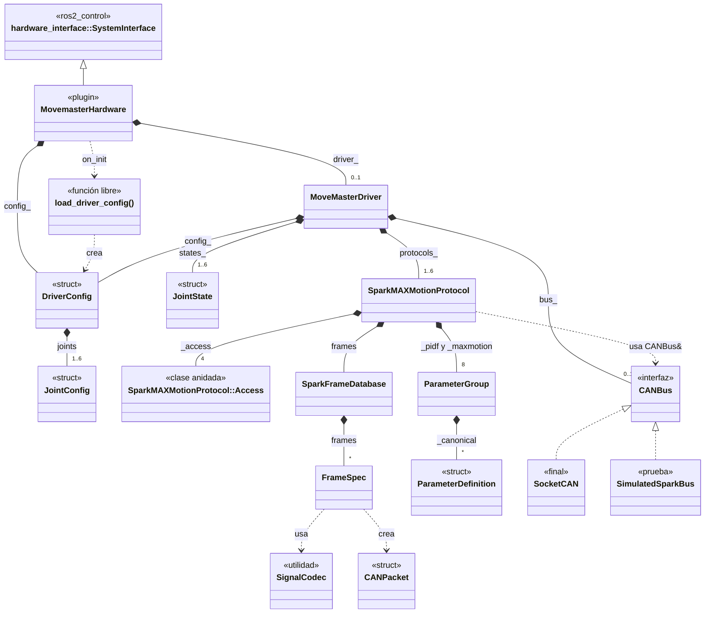
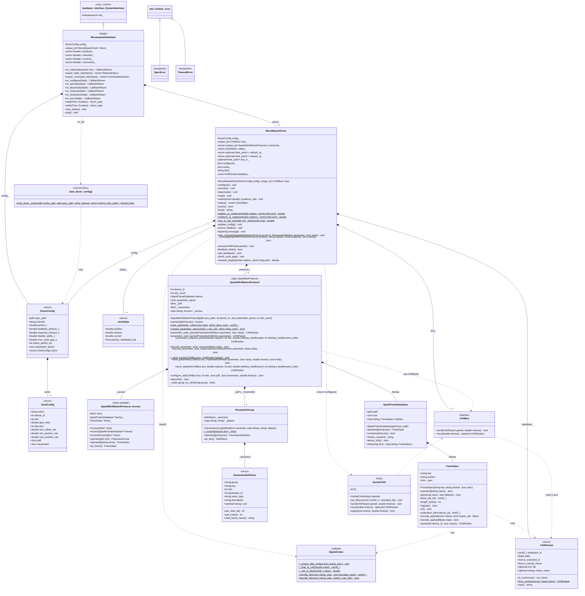

# Diagrama de clases

Clases declaradas en `include/movemaster_hardware/` e implementadas en `src/`.
Se organizan en cuatro capas, de ROS hacia el hardware:

| Capa | Clases | Archivos |
|---|---|---|
| 1. Adaptador ros2_control | `MovemasterHardware` | `movemaster_hardware.hpp`, `movemaster_hardware.cpp` |
| 2. Driver | `MoveMasterDriver`, `DriverConfig`, `JointConfig`, `JointState`, `load_driver_config()` | `movemaster_driver.hpp`, `movemaster_driver.cpp`, `driver_config.cpp` |
| 3. Protocolo SPARK | `SparkMAXMotionProtocol` (con la clase anidada `Access`), `SparkFrameDatabase`, `FrameSpec`, `ParameterGroup`, `ParameterDefinition`, `SignalCodec`, `CANPacket`, `CANBus`, `SpecError`, `TimeoutError` | `sparkmax_json_protocol.hpp`, `sparkmax_json_protocol.cpp` |
| 4. Transporte CAN | `SocketCAN` | `socketcan.hpp`, `socketcan.cpp` |

`CANBus` y `CANPacket` se declaran en el header del protocolo, pero son el
contrato que implementa la capa de transporte.

## Vista general

Solo nombres y relaciones.

Cómo leerlo:

- Rombo negro: composición. La clase del rombo es dueña de la otra, por valor
  o con `unique_ptr`. La etiqueta es el miembro que la guarda; `1..6` significa
  una por articulación.
- Triángulo hueco con línea continua: herencia. Con línea discontinua: implementa
  una interfaz.
- Flecha discontinua: dependencia; usa, crea o llama sin guardar la instancia.

Por claridad, esta vista omite relaciones que sí están en el diagrama completo:
el driver crea el `SocketCAN`, guarda un `CANPacket` constante (el heartbeat) y
usa `SignalCodec` para cuantizar a float32; `CANBus` transporta `CANPacket`;
`SpecError` y `TimeoutError` heredan de `std::runtime_error`.
`SimulatedSparkBus` no forma parte de `src/`: es el bus simulado de
`tests/driver_test.cpp`.

## Quién es dueño del bus

La sección 1 del [README](../README.md) resume la dependencia como
`MovemasterHardware → MoveMasterDriver → SparkMAXMotionProtocol → SocketCAN`.
En el código, el protocolo no es dueño del bus:

- `MoveMasterDriver` guarda el bus (`bus_`) y un `SparkMAXMotionProtocol` por
  articulación (`protocols_`).
- El protocolo solo arma y decodifica tramas. Recibe el bus prestado
  (`CANBus&`) en sus ayudantes síncronos; el driver solo usa
  `write_parameter()`, durante `configure()`, para esperar cada ACK.
- En `read()` y `write()` es el driver quien llama a `bus_->recv()` y
  `bus_->send()`.
- `CANBus` es el punto de inyección: el constructor del driver acepta un
  `unique_ptr<CANBus>`. Si llega vacío, `configure()` abre un `SocketCAN` con
  filtros; las pruebas inyectan `SimulatedSparkBus`.

## Diagrama completo

Atributos y métodos de las clases de `include/movemaster_hardware/`, salvo
destructores, copias eliminadas y los `begin()`, `end()` y `size()` de los
contenedores. Notación: `+` público, `-` privado, `#` protegido; subrayado,
`static`; cursiva, virtual pura. Los tipos se abrevian: sin `std::`, sin
`const&` y sin valores por defecto. Los alias y constantes del namespace
(`Json`, `Bytes`, `DEFAULT_PARAMETER_LAYOUT`, …) están en [API.md](API.md).

Lo que hace cada callback de ros2_control está en la tabla de la sección 6 del
[README](../README.md).

Ambos diagramas se comprobaron con Mermaid 10.9 y 11.17. GitHub los dibuja
directamente; en otro visor, pega el bloque en <https://mermaid.live>.
